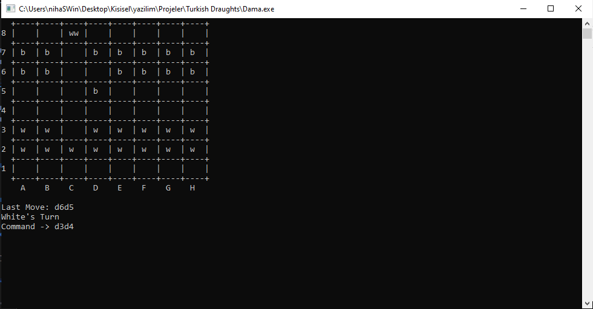

### Project Information
--- 
* Project Name:  
Turkish Draughts
 

* Project Team:  
Fadıl Şahin
 

* Project Date:  
May 2020
 

* Project State And Duration:  
Done, 1 days
 

* Project Description:  
A simple Turkish checkers game. A menu meets you when it is executed. In menu, new game, continue game, end game options can be selected. With new game, a new game is started. With continue game, if there is any interrupted game it is started else new game is started. With end game, Program stops. In the game, moves can be made a2b4 notation like chess. If there is any obligatory move, you have to select one of them. Board state and moves is saved files to make game continuable.
 
 

:exclamation: --------------------------------------------------------------------------------- :exclamation:

- ***Executable file is in [root](Dama.exe) folder***

:exclamation: --------------------------------------------------------------------------------- :exclamation:

### Screenshots
---

### Menu Page 

